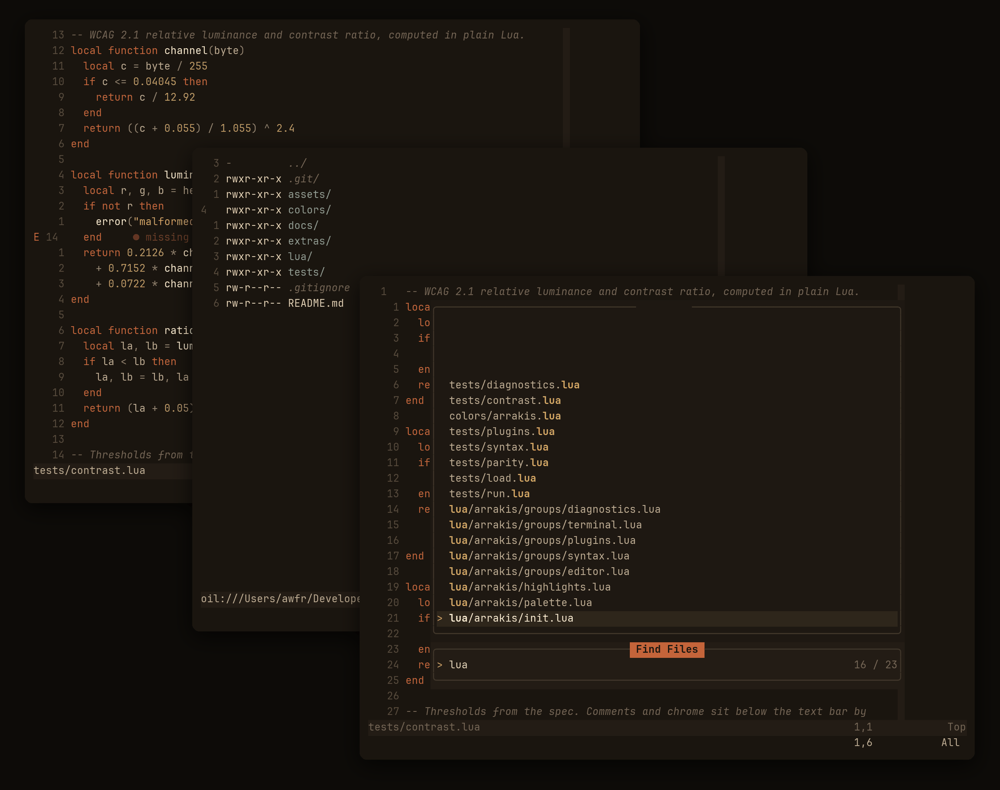

# arrakis.nvim

A desert-night colourscheme for Neovim, with a matching Ghostty theme.



Dark only. One rule governs every colour in it:

> A token gets a hue only if the hue tells you something its name cannot.

Keywords, strings and types carry hue. Names, fields, parameters and
punctuation stay on the sand ramp. Functions are lifted in brightness, not
in hue. Mostly beige, with the occasional flash of spice.

## Requirements

Neovim 0.10 or newer, and a terminal with truecolour support.

## Install

With `vim.pack` (Neovim 0.12+):

```lua
vim.pack.add({ { src = "https://github.com/<you>/arrakis.nvim" } })
vim.cmd.colorscheme("arrakis")
```

With lazy.nvim:

```lua
{
  "<you>/arrakis.nvim",
  priority = 1000,
  config = function()
    vim.cmd.colorscheme("arrakis")
  end,
}
```

## Configuration

Calling `setup()` is optional. Call it before `:colorscheme arrakis`.

```lua
require("arrakis").setup({
  transparent = false,     -- drop backgrounds so the terminal shows through
  italic_comments = true,  -- italics on comments
  overrides = {},          -- highlight groups, applied last and always winning
})
vim.cmd.colorscheme("arrakis")
```

`overrides` takes anything `vim.api.nvim_set_hl` accepts, including groups
the theme does not otherwise set:

```lua
require("arrakis").setup({
  overrides = {
    Comment = { fg = "#8f8170", italic = false },
    ["@keyword"] = { bold = true },
  },
})
```

## Ghostty

```sh
cp extras/ghostty/arrakis ~/.config/ghostty/themes/arrakis
```

Then add this to your Ghostty config:

```
theme = arrakis
```

The config file is `~/.config/ghostty/config` on Linux and BSD. **On macOS
it is `~/Library/Application Support/com.mitchellh.ghostty/config`** — a
`~/.config/ghostty/config` you create there is ignored, so editing it looks
like the theme silently failing. The `themes/` directory above is read on
both platforms.

Reload with `⌘⇧,` (macOS) or `ctrl+shift+,`; Ghostty does not pick up a
theme change in already-open windows without it.

The terminal's ANSI 16 and Neovim's `terminal_color_*` come from the same
values, so `:terminal` and a bare shell look identical.

## Palette

Both sides are maintained by hand. This table is the reference for
reconciling them; `tests/parity.lua` fails if they drift.

| role | hex | | role | hex |
| --- | --- | --- | --- | --- |
| `bg` | `#1a150f` | | `ember` keywords | `#c4643a` |
| `bg_float` | `#1e1812` | | `spice` strings | `#d8a657` |
| `bg_alt` | `#231c15` | | `ibad` types | `#4fa8c5` |
| `bg_sel` | `#2e261b` | | `num` constants | `#bf9a5e` |
| `border` | `#403629` | | `scrub` | `#8aa66b` |
| `linenr` | `#564a3c` | | `water` | `#5fa89b` |
| `muted` comments | `#746455` | | `melange` | `#b07ea8` |
| `subtle` punctuation | `#8f8170` | | `blood` errors | `#d55d4f` |
| `fg_dim` vars | `#bcab92` | | | |
| `fg` | `#e3d2b4` | | | |
| `fg_bright` functions | `#f7ecd6` | | | |

Every foreground clears WCAG AA against the background; comments and
chrome sit deliberately below it. The thresholds are asserted by
`tests/contrast.lua`.

## Plugins

Themed: [oil.nvim], [telescope.nvim], [blink.cmp], [trouble.nvim],
[toggleterm.nvim], [mini.nvim], [gitsigns.nvim].

[oil.nvim]: https://github.com/stevearc/oil.nvim
[telescope.nvim]: https://github.com/nvim-telescope/telescope.nvim
[blink.cmp]: https://github.com/saghen/blink.cmp
[trouble.nvim]: https://github.com/folke/trouble.nvim
[toggleterm.nvim]: https://github.com/akinsho/toggleterm.nvim
[mini.nvim]: https://github.com/nvim-mini/mini.nvim
[gitsigns.nvim]: https://github.com/lewis6991/gitsigns.nvim

## Tests

From the repository root:

```sh
nvim --headless -l tests/run.lua
```

No framework and no dependencies. Three things are checked: that the
scheme loads and every group resolves, that every colour clears its
contrast threshold, and that the Ghostty theme has not drifted from the
Lua palette.

## Licence

MIT
